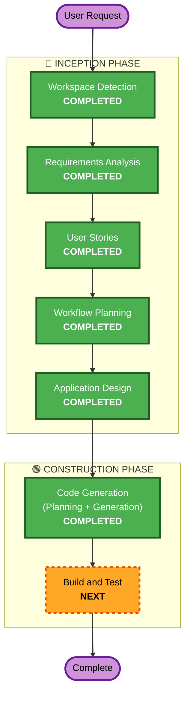

# Execution Plan

## Detailed Analysis Summary

### Transformation Scope
- **Transformation Type**: Single unit (전체 통합)
- **Primary Changes**: Skeleton stubs → 완전한 3-모델 파이프라인 구현
- **Related Components**: Bedrock, Athena, S3, Glue Catalog, Streamlit

### Change Impact Assessment
- **User-facing changes**: Yes — Streamlit 챗봇 UI 전체 구현
- **Structural changes**: No — 기존 skeleton 구조 유지
- **Data model changes**: No — fact_events.csv 스키마 그대로 사용
- **API changes**: No — 외부 API 없음 (Bedrock/Athena는 AWS SDK 호출)
- **NFR impact**: No — 프로토타입 수준, NFR 미적용

### Risk Assessment
- **Risk Level**: Low
- **Rollback Complexity**: Easy (skeleton stubs로 복원 가능)
- **Testing Complexity**: Moderate (AWS 서비스 연동 필요)

## Workflow Visualization

## Phases to Execute

### 🔵 INCEPTION PHASE
- [x] Workspace Detection (COMPLETED)
- [x] Reverse Engineering (SKIPPED — stub-level code, no logic to reverse)
- [x] Requirements Analysis (COMPLETED)
- [x] User Stories (COMPLETED)
- [x] Workflow Planning (COMPLETED)
- [x] Application Design (COMPLETED)
- [x] Units Planning (SKIPPED)
  - **Rationale**: 단일 유닛 프로젝트, 분해 불필요
- [x] Units Generation (SKIPPED)
  - **Rationale**: 단일 유닛 프로젝트, unit-of-work 문서 불필요

### 🟢 CONSTRUCTION PHASE
- [x] Functional Design (SKIPPED)
  - **Rationale**: Application Design에서 충분히 정의됨
- [x] NFR Requirements (SKIPPED)
  - **Rationale**: 사용자 결정 — Security/PBT 모두 비활성화
- [x] NFR Design (SKIPPED)
  - **Rationale**: NFR Requirements 스킵에 따라 자동 스킵
- [x] Infrastructure Design (SKIPPED)
  - **Rationale**: 인프라는 setup_infra.py + setup_aws.sh로 별도 관리
- [x] Code Generation (COMPLETED)
  - **Rationale**: 12개 스텝 모두 완료, 11개 파일 생성/수정
- [ ] Build and Test (NEXT)
  - **Rationale**: 빌드 검증 및 통합 테스트 필요

### 🟡 OPERATIONS PHASE
- [ ] Operations (PLACEHOLDER)
  - **Rationale**: 향후 배포/모니터링 워크플로우

## Estimated Timeline
- **Total Phases Executed**: 7 (WD + RA + US + WP + AD + CG + BT)
- **Completed**: 6/7
- **Remaining**: Build and Test

## Success Criteria
- **Primary Goal**: 자연어 → SQL → 차트 + 설명 파이프라인 동작
- **Key Deliverables**: Streamlit 챗봇 앱, 3-모델 파이프라인, 동적 마트 생성
- **Quality Gates**: Athena 쿼리 성공, 차트 이미지 생성, 한국어 설명 출력
